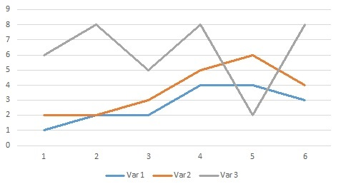
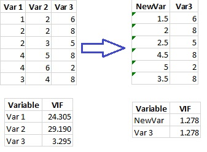
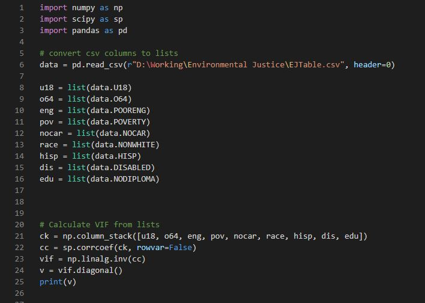
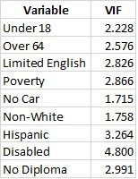

A common issue we encounter when creating models and building indices involves potential correlation between two or more criteria. Certain variables, although independent of each other, could still be correlated. This could potentially skew the results of an analysis, in which multiple different criteria follow similar patterns and point to the same conclusions. This problem of correlation among several independent variables is referred to as <b>multicollinearity</b>. In the graph below, variables 1 and 2 are highly correlated. Although they are independent, the behavior of one variable can predict the behavior of the other. Variable 3, on the other hand, does not correlate with the other two, making it a unique contributor to the dataset. If these variables were to be incorporated into a model, the correlation between these two variables would need to be addressed.

Multicollinearity across datasets with numerous different variables can be quantified through calculation of the <b>Variance Inflation Factor (VIF)</b> for each variable. This is a single number assigned to each variable, which indicates the likelihood that the behavior of that variable could be predicted by the behavior of one or more other variables in the dataset. A VIF of 1 indicates that there is no multicollinearity, and a VIF over 5 indicates a high degree of multicollinearity between a variable and one or more other variables. This can be addressed either by simply removing the variable, or by performing a <b>Principal Component Analysis (PCA)</b>, in which highly correlated variables are grouped together as a single variable. In the case of the three variables in graph above, averaging together variables 1 and 2, creating a new variable, Newvar, significantly reduces the multicollinearity within the dataset down to an acceptable level.

VIF can be calculated manually with the aid of a correlation matrix, determining the correlation coefficient for each unique combination of variables, however there are several strategies for automating this calculation. Below is an example of python code used to assess the multicollinearity of the variables in our envionmental justice model.

In this case, the VIF for each criteria of the envionmental justice model is within an acceptable range, although the VIF for the disabled population is relatively high, near the threshold of 5. It is likely that if more criteria were added to this model, they would increase the degree of multicollinearity, making a PCA necessary.

